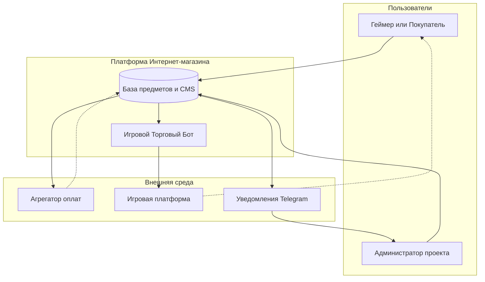
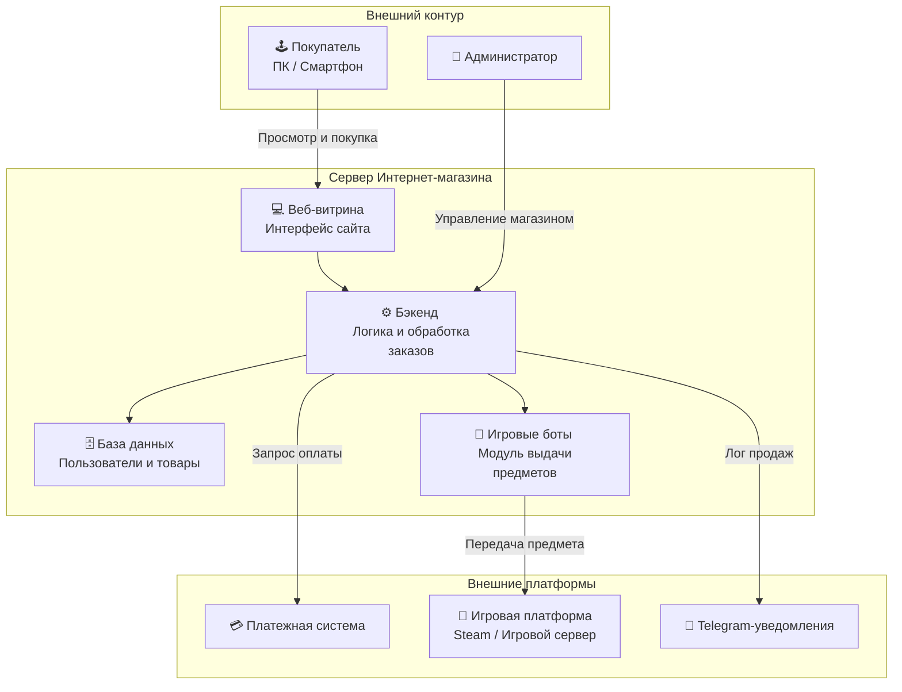
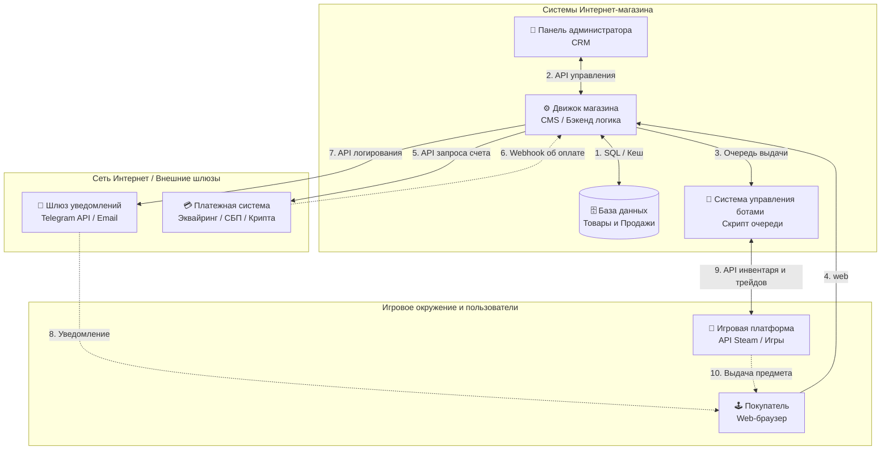
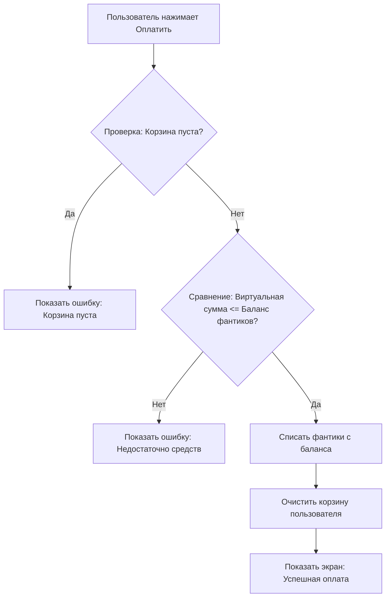
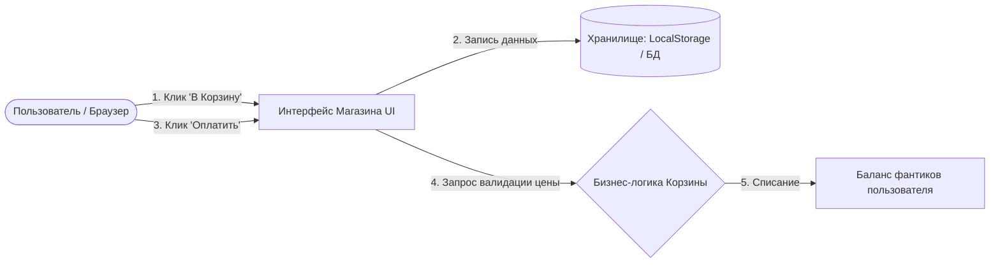

# 1 Общие сведения
# 1.1 Основание для выполнения работ 
договор гражданско-правового характера 
# 1.2 Заказчик работ 
Заказчик: Физическое лицо
# 1.3 Сведения об источниках и порядке финансирования 
Финансирование работ осуществляется за счет собственных средств Заказчика
# 1.4 Цель выполнения работ
Целью выполнения работ является разработка функционального интернет-магазина "dotashop", предназначенного для представления и реализации товаров Заказчика в сети, автоматизации процесса приема и обработки заказов
# 1.5 Состав работ 
По настоящему Договору Исполнитель выполняет перечисленные ниже работы:
1. Проектирование архитектуры и структуры Интернет-магазина
2. Разработка дизайн-макетов и пользовательских интерфейсов
3. Программирование и интеграция функциональных модулей
4. Настройка платежных шлюзов и сервисов логистики
5. Развертывание Интернет-магазина и приемо-сдаточные испытания
# 1.6 Сроки выполнения работ 
в таблице 1 представлены этапы выполнения работ по договору.
Таблица 1 - Этапы выполнения работ 
| № этапа | Наименование этапа | Срок сдачи работ | Результат работ |
| :---: | :--- | :--- | :--- |
| **1** | Проектирование и разработка дизайна Интернет-магазина | Не более 20 дней с момента внесения предоплаты | <ul><li>Интерактивный прототип структуры сайта</li><li>Дизайн-макеты всех страниц в Figma (ПК и mobile)</li><li>Утвержденное Техническое задание</li></ul> |
| **2** | Программирование, интеграция модулей и запуск Интернет-магазина | Не более 30 дней с момента утверждения Этапа 1 | <ul><li>Рабочий сайт Интернет-магазина на хостинге</li><li>Подключенный эквайринг и модули доставки</li><li>Исходный код проекта в репозитории</li><li>Доступы к панели управления (CMS)</li><li>Инструкция администратора</li></ul> |
| **3** | Опытная эксплуатация и финальная приемка | В течение 14 дней с момента запуска сайта | <ul><li>Протокол успешного тестирования систем оплаты</li><li>Подписанный Акт приема-передачи работ</li></ul> |
# 1.7 Место выполнения работ 
Работы выполняются на территории Российской федерации.
# 2 Назначение интернет-магазина 
Интернет-магазин должен представлять собой единый веб-ресурс для автоматизации процесса дистанционных продаж товаров Заказчика, взаимодействия с покупателями и обработки поступающих заказов. На базе интернет-магазина Заказчик будет осуществлять коммерческую деятельность по реализации своей продукции физическим и юридическим лицам. Пользователи ресурса должны иметь доступ к актуальному каталогу товаров, информации о наличии позиций, возможность оформления онлайн-заказа, выбора способов доставки и проведения оплаты в режиме реального времени посредством веб-интерфейса, адаптированного для персональных компьютеров и мобильных устройств.
# 3 Описание работы интернет-магазина 
# 3.1 Схема взаимодействия пользователей с платформой Интернет-магазина
Взаимодействие с платформой Интернет-магазина строится на основе ролевой модели, включающей Покупателя  и Администратора. Покупатель с использованием web-браузера персонального компьютера или мобильного устройства переходит на сайт Интернет-магазина, осуществляет поиск и выбор товаров в интерактивном каталоге. Выбранные позиции добавляются в виртуальную корзину с автоматическим расчетом общей стоимости. При оформлении заказа Покупатель вводит контактные данные, выбирает интегрированный способ доставки и производит оплату через платежный шлюз в режиме реального времени. По факту успешной оплаты платежный шлюз передает уведомление в систему управления сайтом. Администратор Интернет-магазина получает мгновенное уведомление о новом оплаченном заказе. В панели управления сайтом Администратор видит полные данные покупателя, состав заказа, статус оплаты и автоматически сформированный трек-номер или накладную для службы доставки. После сборки и передачи товара в логистическую службу Администратор меняет статус заказа в CMS, что инициирует автоматическую отправку трек-номера Покупателю для отслеживания посылки.

Рисунок 1. Типовая схема взаимодействия компонентов Интернет-магазина

# 3.2 Архитектура интернет-магазина 
Архитектура Интернет-магазина должна разрабатываться с учетом размещения его компонентов в изолированной облачной инфраструктуре. Общедоступные веб-сервисы, включая пользовательский интерфейс, должны быть вынесены в отдельный защищенный сегмент сети для предотвращения прямых DDoS-атак на внутреннюю логику системы. Пользовательские интерфейсы сайта, базы данных и программные модули торговых ботов должны быть размещены на функционально разделенных серверах или изолированных контейнерах. Все ключевые компоненты Интернет-магазина должны обладать возможностью горизонтального масштабирования. Увеличение вычислительных мощностей для веб-витрины в периоды пиковых распродаж игровых предметов или увеличение количества активных торговых ботов для выдачи товаров должно выполняться независимо от других компонентов платформы.

Рисунок 2-1. Верхнеуровневая схема прикладного ПО Интернет-магазина

В результате внедрения платформы Интернет-магазина должна быть обеспечена поддержка ключевых бизнес-процессов на всех этапах жизненного цикла цифрового продукта и взаимодействия с клиентами.

Рисунок 2-2. Верхне-уровневая схема интеграции для пилотного запуска

### 3.3 Сценарии использования системы

#### 3.3.1 Авторизация и создание тестового профиля
* **Действующие лица:** Пользователь.
* **Предусловия:** Пользователь впервые открыл сайт или хочет войти в тестовый аккаунт.
* **Основные шаги сценария:**
  1. Пользователь нажимает кнопку «Войти» / «Зарегистрироваться».
  2. Система создает профиль и автоматически начисляет на стартовый баланс приветственную сумму виртуальной валюты.
  3. В шапке сайта отображается имя пользователя и его текущий баланс.

#### 3.3.2 Просмотр каталога и добавление предметов в корзину
* **Действующие лица:** Пользователь.
* **Основные шаги сценария:**
  1. Пользователь открывает главную страницу или раздел «Каталог».
  2. Пользователь использует фильтры (по героям, редкости предметов: Arcana, Immortal и т.д.).
  3. Пользователь нажимает кнопку «В корзину» на карточке товара.
  4. Система добавляет предмет в корзину, обновляет счетчик товаров в шапке сайта и сохраняет состояние.

#### 3.3.3 Управление корзиной и симуляция оплаты («фантиками»)
* **Действующие лица:** Пользователь.
* **Предусловия:** В корзину добавлен хотя бы один предмет.
* **Основные шаги сценария:**
  1. Пользователь переходит на страницу «Корзина».
  2. Пользователь проверяет список предметов, общую стоимость заказа и сравнивает ее со своим балансом.
  3. Пользователь нажимает кнопку Оплатить.
  4. **Проверка баланса:**
     * *Если баланс достаточен:* Система списывает сумму со счета пользователя, очищает корзину и выводит окно «Успешная оплата! Предметы отправлены в ваш инвентарь».
     * *Если баланса не хватает:* Система прерывает операцию и выводит сообщение: «Недостаточно для оплаты».

#### 3.3.4 Блок-схема процесса «Покупка за фантики»
*Ниже представлена схема обработки заказа при нажатии кнопки оплаты:*

---

## 4. Требования к системе

### 4.1 Функциональные требования
Система должна состоять из следующих логических модулей/компонентов:
* **Модуль каталога товаров:** Отображение карточек предметов (изображение, название, привязка к герою, редкость, цена).
* **Модуль фильтрации:** Сортировка по цене, фильтр по качеству предметов.
* **Модуль корзины:** Хранение выбранных товаров, пересчет общей стоимости при изменении количества.
* **Модуль симуляции профиля:** Отображение баланса и кнопка для «обнуления/начисления» баланса.

### 4.2 Схема архитектуры приложения (Информационные потоки)

### 4.3 Нефункциональные требования
* **Интерфейс:** Адаптивная верстка. Стилистика должна напоминать интерфейс внутри игры Dota 2.
* **Скорость работы:** Время отклика интерфейса при добавлении товара в корзину не должно превышать 0.2 секунды.
* **Автономность:** Так как оплата имитационная, приложение должно работать без подключения к сторонним банковским API.

---
### 5. Состав и содержание работ по разработке веб-сайта
Разработка проекта разбита на последовательные этапы, каждый из которых включает проектирование, верстку и программирование конкретных подсистем
### 5.1 Проектирование и подготовка структуры данных 
На данном этапе формируется база данных, содержащая полную информацию об ассортименте магазина. Каждый предмет Dota 2 описывается набором атрибутов:
*`id` - уникальный идентификатор товара.
*`name` - официальное внутриигровое название предмета. 
*`hero` - имя персонажа, которому принадлежит предмет.
*`rarity` - категория редкости для фильтрации. 
*`price` - стоимость товара.
*`image_url` - прямая ссылка на изображения скина или иконку из игры. 
### 5.2 Разработка интерфейса пользователя.
Интерфейс приложения создается в темной игровой стилистике Dota 2. Разрабатываются следующие визуальные блоки: 
1. **Шапка сайта:**
   *Логотип магазина;
   *Навигационное меню;
   *Виджет профиля: имя тестового пользователя, текущий баланс и кнопка пополнения счета;
   *Иконка корзины с счетчиком добавленных вещей;
2. **Блок каталога:**
   *Интерактивная панель фильтров;
   *Сетка карточек товаров. Каждая карточка содержит изображение предмета его названия, индикатор редкости, цену и кнопку в корзину;
3. **Модальное окно "Корзина":**
   *Список выбранных предметов в виде таблицы;
   *Инструменты управления кнопки изменения количества и кнопка удаления предмета из списка;
   *Итоговый блок: подсчет суммарной стоимости всех товаров;
   *Главная управляющая кнопка:
   **"Оплатить**.
### 5.3 Реализация бизнес-логики и симулятора транзакций
Этот этап отвечает за интерактивность сайта и программирование:
1. **Логика управления корзиной.**
   *Функция добавления элемента: при повторном клике на один и тот же предмет в каталоге его количество в корзине увеличивается, а не создается дубликат строки.
   *Функция динамического пересчета: при изменении количества товаров в корзине общая сумма заказа мгновенно пересчитывается без перезагрузки страницы.
2.**Алгоритм симуляции оплаты.**
   *При нажатии на кнопку оплаты скрипт считывает текущее значение из переменной баланса пользователя и сравнивает его с итоговой суммой корзины.
   *Реализуются два ветвления алгоритма подробно описанные в сценариях (п.3.3.3).
3.**Хранение состояния.**
   *Интеграция с механизмом `LocalStorage` браузера. Это необходимо, чтобы при случайном обновлении страницы или закрытии вкладки у пользователя не пропадали добавленные вещи в корзину и не сбрасывался измененный баланс.
### 5.4 Тестирование и отладка
Проведение ручного и сценарного тестирования для исключения багов перед сдачей работы:
*Проверка ввода некорректных данных;
*Проверка поведения интерфейса при пустой корзине;
*Проверка корректности округления цен при расчете итоговой суммы заказа.
